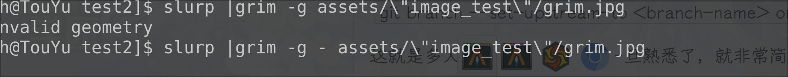

# gitee hi

## 我做了一点修改
## 现在以及基本配置好了, 并且还学到了如何回退至之前的版本。
- [点我查看git帮助](https://www.liaoxuefeng.com/wiki/896043488029600/897013573512192 '学习git强烈推荐，写的太棒了。而我的记录只是最基本的')
- [点我前往我的git配置记录](s使用git命令.md  '一小步 也是一大步。整个体验还是不错的')

## 第三次修改

## 基本配置完成

- 这是clone克隆下来，switch -c 新建的new local版本, **主要是尝试推送**
- 附上截图和wayfire下截图方式
``` bash
slurp |grim -g - assets/"image_test"/grim.jpg
```

- 没有冲突,前面忘记截图了！😃

- 截图 

- [ 点我前往git配置记录 ](s使用git命令.md '一小步 也是一大步。整个体验还是不错的') 
- 写一个表格试试
  
  | 1   | 2   | 3   | 4   | 5   |
  | --- | --- | --- | --- | --- |
  | a   | b   | c   | d   | e   |
  
  
