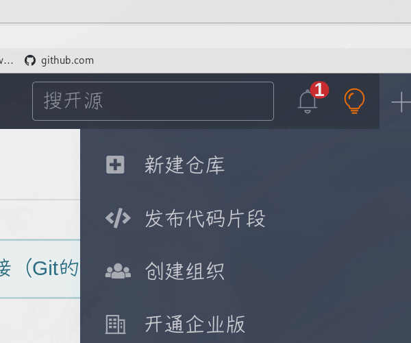
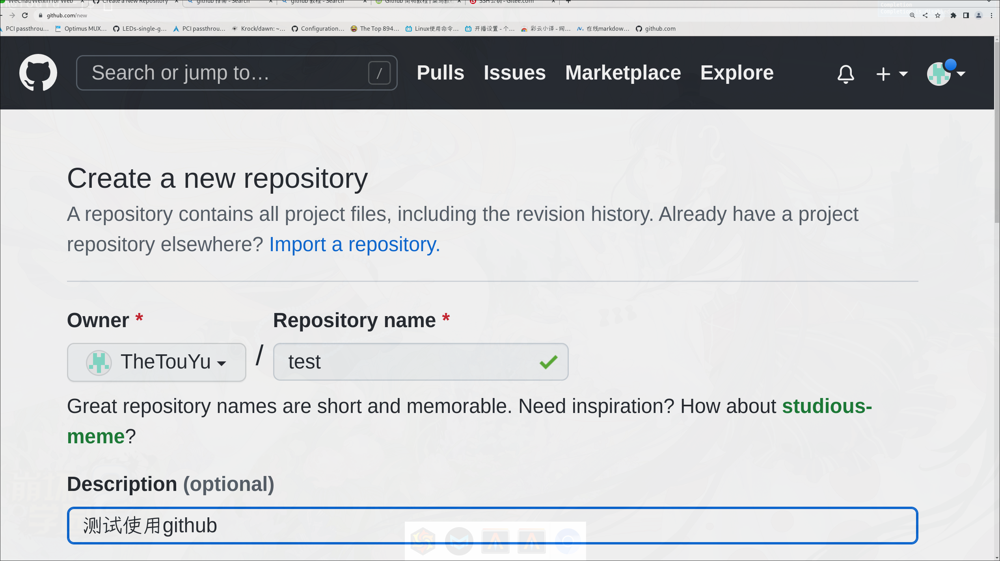
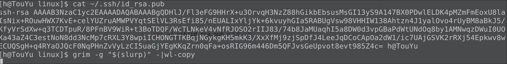
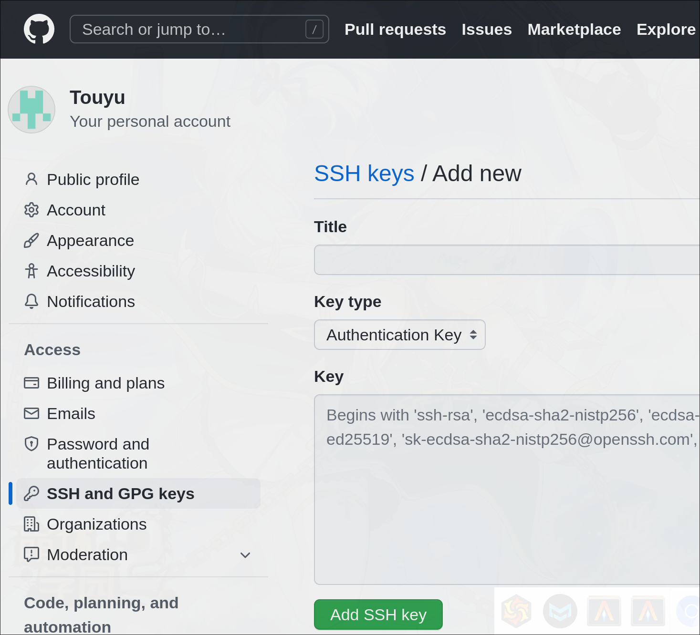
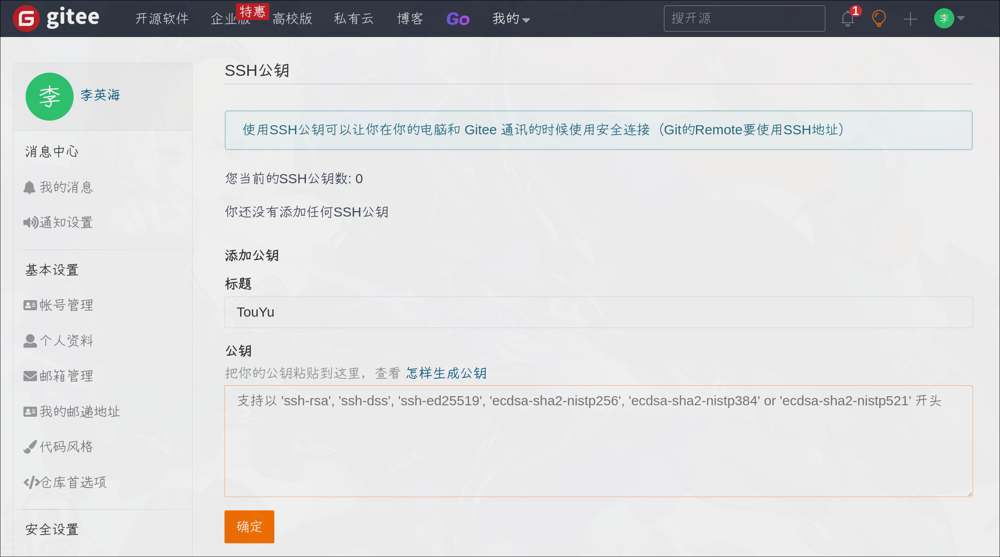
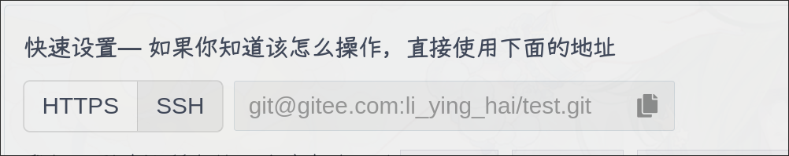
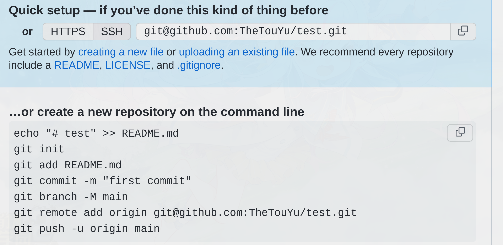
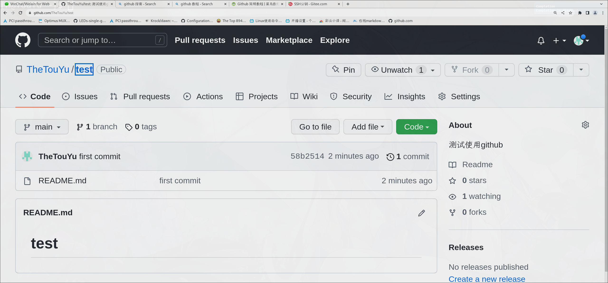

# 使用git命令

1. ## 注册github/gitee(国内加速) > 创建一个仓库
   
   gitee
   
   
   
   github
   
   

2. ## 添加一个ssh钥匙(可选)   github需要使用ssh加密
   
   - ```bash
      ssh-keygen  #生成钥匙
     ```
   
   - ```bash
     cat ~/.ssh/id_rsa.pub #查看公匙
     ```
     
     
   
   - 复制刚刚查看到的公匙 > 打开github/gitee设置 > 将ssh公匙粘贴进去
     
     标题随意
     
     
     
     
     
     ```bash
     ssh -T git@github.com #验证一下是否ok
     ```

3. ## 配置 > 上传至仓库
   
   ```bash
   mkdir my_workdirectory && cd my_workdirectory  #选择你的工作目录
   ```
   
   - 设置你的用户名和邮箱 (github)
     
     #### 这里需要注意，这个是全局设置，那么以后默认都是使用github
     
     ```bash
     git config --global user.name "your name"
     git config --global user.email "your_email@youremail.com"
     ```
     
     有时候github网络不好，我们可能想使用国内的gitee,我们可以为每个仓库单独设置
     
     ```bash
     git config --local user.name "your name"
     git config --local user.email "your_email@youremail.com"
     ```
- 选择ssh > 复制快速设置代码  
  
  格式很好记  
  
  - git@github.com:你的名字/你仓库名字.git
  
  - git@gitee:你的名字/你仓库名字.git
  
  gitee
  
  
  
  github
  
  
  
     
  
  ```bash
  echo "# test" >> README.md  
  #这个是默认的展示文件，使用的就是markdown语法
  git init   
  git add README.md
  git commit -m "first commit"
  git branch -M main
  git remote add origin git@github.com:TheTouYu/test.git
  git push -u origin main
  ```
  
  ### 好啦，你的第一个仓库就完成了！
  
     
4. ## 日常使用实例  (将本文git配置过程上传之服务器)
   
   - 现在仓库什么都没有，我们先保存markdown文件，以.md结尾 
     
   
   - 我们添加新的文件 
     
     ```bash
     git add s使用git命令.md  
     ```
   
   - 为这一次知识库的版本变化做一个评注,并提交所以的修改
     
     ```bash
     git commit -m "我添加了一个新的文件，修改"
     ```
   
   - 让我们把数据同步到服务器
     
     ```bash
     git push origin master
     ```
   
   - 好了，现在可以访问你的主页了。格式**gitee.com/**你的用户名/你的仓库
     
     比如我的主页： <https://gitee.com/TheTouYu/test>
     
5. ## 一些git操作
   - git add remote origin git@gitee.com/TheTouYu/linux #添加远程仓库，名字叫做origin
   - git reflog #查看最近的commit
   - git reflog --grapha --pretty=oneline --abre-commit #用简短的图表查看各个分支的走向
   - git reset --hard rstbra #默认的补全是切换分支，还可以用HEAD^^ (^^表示回到前两次commit)
     , HEAD{3} 回到三次之前的commit,   garstrst(回到任意一次commit,通过reflog log查看)
   - git switch -c #创建并切换到新的分支  git switch main #切换到main分支
   - #如何回滚远程仓库？
     1. git pull 
     2. git merge origin/master
     3. 做些修改，解决冲突（可以直接删除)
     4. git add *
     5. git commit -m '做了什么？解决了冲突'
     5. git push
   - #如何用一个其他的分支(主分支不存在）更新远程仓库的分支
     1. git switch -c new_branch
     2. git config.streame_to_ orgin/master #有点不记得了，可以pull查看它的提示
     3. git pull #做些修改
     4. git add *
     5. git commit -m ' xxx '
     6. git push origin/dev #一定要选择分支

     
     

          
